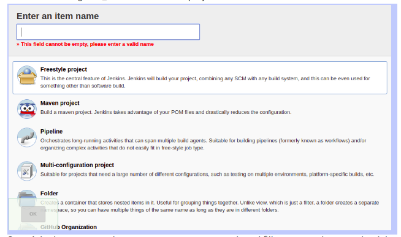
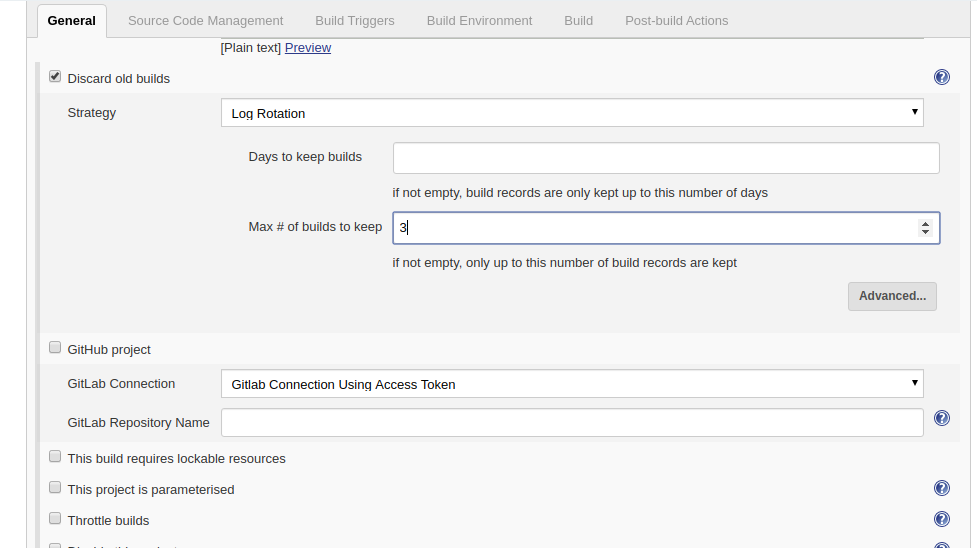
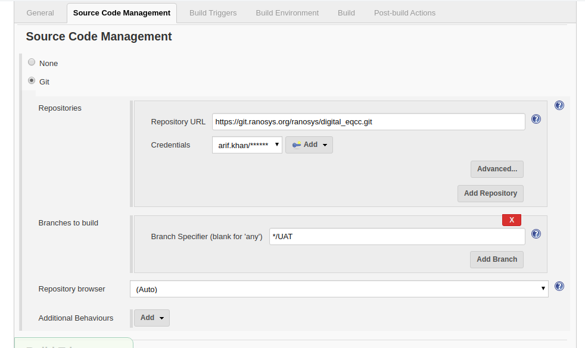
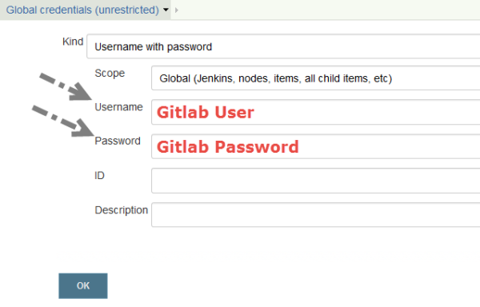
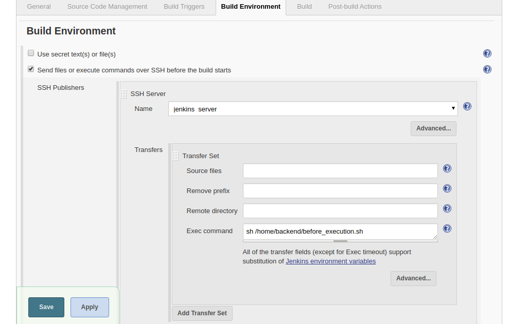
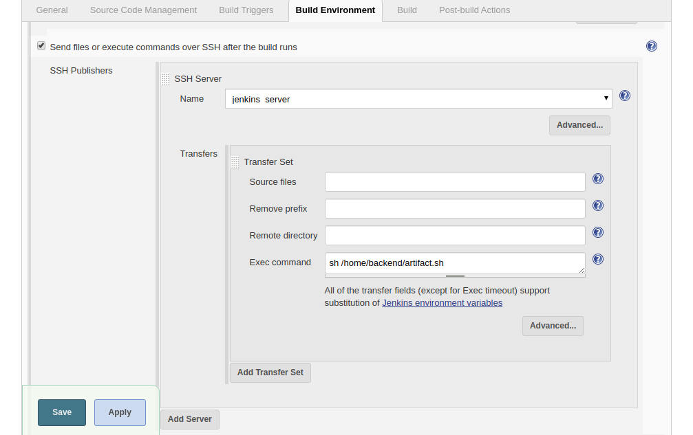

# Integrate AWS Codedeploy with jenkins

### Step 1 : Configure Jenkins
- Login to Jenkins Dashboard and click on **new item** 
- 
- Select the **free style project**, enter the **project name** and **click** on **Ok**.
- Click **“Discard old builds”** checkbox and write **“3”** for **“Max # of builds to keep“**. It only keeps last 3 builds and saves disk space.
- For **“GitLab connection”** field, select predefined connection which is done with GitLab plugin above.
- 
- In the **source code management** set **source** git and fill your **repository**, **credential** & the branch. Fill **“Repository URL“**, **Select Credentials** which is added above, **set branch**, **select repository** browser as gitlab, and write your project URL and GitLab version as shown below.
- 
- Then, add your **GitLab username and password** as shown below and **click OK**.
- 
- In the **Build Environment** section check on the **“Send files or execute commands over SSH before the build starts”** and then select the **ssh server** which is **jenkins server** and in the Exec command section run the you bash script file which is `before_execution.sh
`. 
This script move last updated build which is available in S3 to archive folder with append current timestamp. So that is new deployment is failed then when rollback we get latest build from archive folder and again move to updated folder. When we add any build in updated folder then codepipeline is detect it and initiate codedeploy to deploy that build to EC2 server.
- 
```shell
#!/bin/bash
# before_execution.sh file
set -x
pwd
sudo aws s3 mv s3://digital-eqcc-backend/updated_code/digital_eqcc_uat.tar.gz s3://digital-eqcc-backend/archive/digital_eqcc_uat.`date +%Y-%m-%d_%H-%M-%s`.tar.gz
```
- In the **Build Environment** section check on **“Send files or execute commands over SSH after the build runs”** and then select the **ssh server** which is **jenkins server** and in the Exec command section run the you bash script file which is `artifact.sh`. This Script make tar/zip after from the lastest code pull from git into project's jenkins server workspace and store that build into home folder. Than the script copy that build from home folder to S3 bucket updated code folder so that codepipeline will detect it and initiate codedeploy to deploy that build to EC2 server.
- 
```shell
#!/bin/bash
#artifact.sh
set -x
pwd
cd /var/lib/jenkins/workspace/digital_eqcc_uat
sudo tar -cvf /home/backend/digital_eqcc_uat.tar.gz .
sudo aws s3 cp /home/backend/digital_eqcc_uat.tar.gz s3://digital-eqcc-backend/updated_code/
```
- Click on Save

### Step 2 : Configure Jenkins Server 
- Login to AWS console and create one IAM user with s3 administrator
- Login in jenkins server.
- Install `aws-cli` on jenkins server with below command:
```shell
sudo apt-get install awscli
```
- Now configure the aws cli with below command:
```shell
aws configure
```
- After run this command need to provide some details like access key & secret key
- Now we need to write to scripts which we mentioned in jenkins
```shell
#!/bin/bash
# before_execution.sh file
set -x
pwd
sudo aws s3 mv s3://digital-eqcc-backend/updated_code/digital_eqcc_uat.tar.gz s3://digital-eqcc-backend/archive/digital_eqcc_uat.`date +%Y-%m-%d_%H-%M-%s`.tar.gz
```
```shell
#!/bin/bash
#artifact.sh
set -x
pwd
cd /var/lib/jenkins/workspace/digital_eqcc_uat
sudo tar -cvf /home/backend/digital_eqcc_uat.tar.gz .
sudo aws s3 cp /home/backend/digital_eqcc_uat.tar.gz s3://digital-eqcc-backend/updated_code/
```
