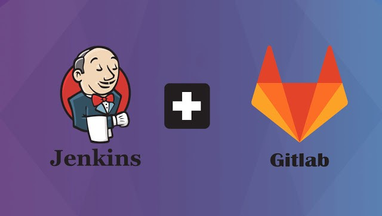
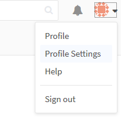
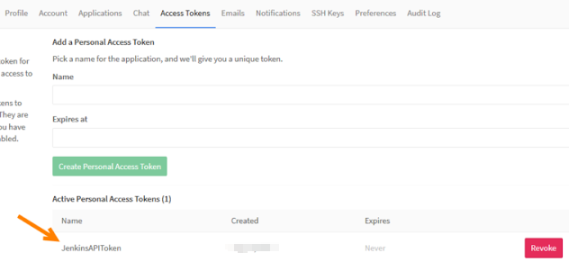
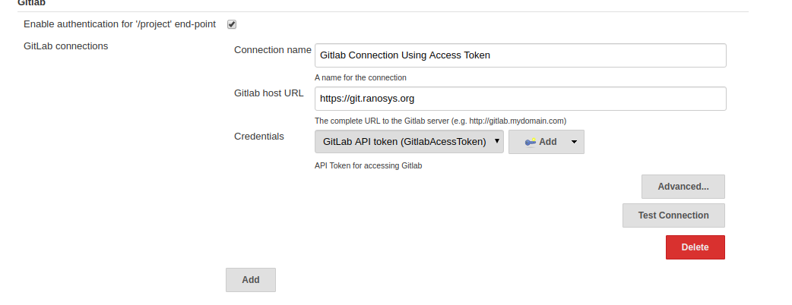
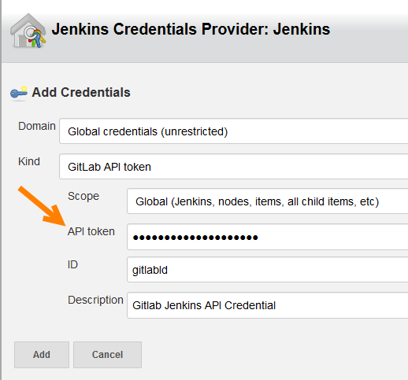

# How to integrate Jenkins with Gitlab

Jenkins is a widely used Continuous Integration (CI) tool now-a-days and Gitlab is the leading integrated product for the entire software development life cycle. Even though we have CI feature within the Gitlab, many prefer to use Jenkins along with Gitlab since it’s more extendable with a lot more features and simple user interface.

### Requirements for Gitlab — Jenkins Integration
- **Jenkins GitLab Plugin** :
Build trigger that allows GitLab to trigger Jenkins builds when code is pushed or a merge request is created.
- **Jenkins Git Plugin** : This plugin allows use of Git as a build SCM, including repository browsers for several providers.
- **Jenkins GitLab Hook plugin** : Enables Gitlab web hooks to be used to trigger SMC polling on Gitlab projects

First, we must create a user that Jenkins will use to interact via the GitLab API. You should set this user as global admin or add as a member to related Group/Project. In order to report build status, developer permission required.

### Step 1 : Generate Gitlab API Token
- First open GitLab and go to Profile Settings
- 
- Then, click “Access Token” and create a Jenkins API Token.
- 
- Then, save and copy this API Token. Let’s go on with Configure the Jenkins Server.

### Step 2 : Configure the Jenkins Server
- Go to Jenkins and install Jenkins GitLab Plugin and Jenkins Git Plugin.
- Go to Manage Jenkins -> Configure System and scroll down to the ‘GitLab‘ section.
- Write a custom connection name, enter the GitLab server URL in the ‘GitLab host URL‘ field and click Add -> Jenkins button.
- Then, fill required fields as shown below with the Jenkins Access API Token which we created in GitLab before.
- 
- 
- Then, select this API Token credential and finally click “Test” and see the “Success” message.