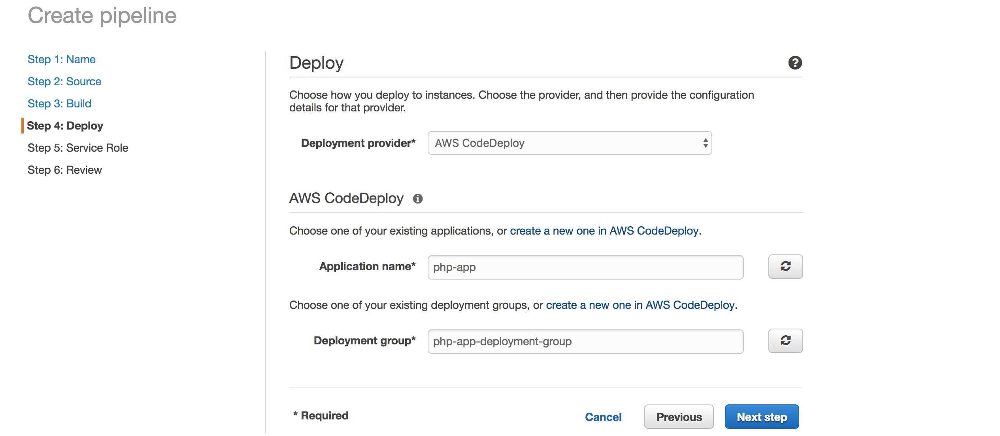

# Setup Continuous Integration and Deployment(CI/CD) for a application with AWS Codedeploy and CodePipeline using S3

CodePipeline is a continuous delivery service that enables you model, visualize and automate the steps required to release your application and software.

CodePipeline automates the build, test and the deploy phases of your application release process in the event that there is a code change, based on the release model you have earlier specified.

In this article, we will create a simple application, then we will upload it to a S3 and we will let CodePipeline handle the automatic delivery and deployment of the application to an EC2 instance.

Lets set the ball rolling.


### Step 1 : Create a Simple Application
Lets create a application with this structure:

```
php-aws-codepipeline
├── index.php
├── vendor
├── composer.json
├── appscep.yaml
├── scripts
│   └── start_server.sh
└── src ( folder )
└── .gitignore
```

create a folder `aws_codepipeline` then create an application in it.

Now we need to indicate deployment specifications. We will do this by creating a `appspec.yml` file in the root folder. The `appspec.yml` is used by CodeDeploy to determine:

- What it should install onto your instances from your application revision in Amazon S3 or GitHub.
- Which lifecycle event hooks to run in response to deployment lifecycle events.

> The Lifecycle event hooks run in this order:
> ApplicationStop -> BeforeInstall -> AfterInstall -> ApplicationStart

**appspec.yml**
```shell
version: 0.0
os: linux
files:
  - source: /
    destination: /var/www/html/aws_codepipeline_temp/
    #overwrite: true
hooks:
  AfterInstall:
    - location: scripts/start_server.sh
      timeout: 30
  #BeforeInstall:
    #- location: scripts/install_dependencies.sh
    #  timeout: 300
    #  runas: root
    #- location: scripts/install_composer_dependencies.sh
    #  timeout: 300
    #  runas: root
  #ApplicationStop:
    #- location: scripts/stop_server.sh
    #  timeout: 30
    #  runas: root
```

Create a `scripts` folder where we will define our bash scripts to be executed at different stages of the lifecycle.


~~The first hook CodeDeploy will apply is the ApplicationStop hook and we have specified the bash script to be executed at that stage, the scripts/stop_server.sh file.~~

~~Create a `stop_server.sh` file in the `scripts` folder:~~

```shell
#!/bin/bash
service httpd stop
```

~~After the ApplicationStop hook is executed, CodeDeploy moves to the next stage, the BeforeInstall stage.~~

~~Create a `install_dependencies.sh` file in the `scripts` folder:~~

```shell
#!/bin/bash
if ! [ -x "$(command -v httpd)" ]; then yum install -y httpd24 >&2;   exit 1; fi # install apache if not already installed
```

~~In the AfterInstall stage, we will define two bash scripts:~~

~~The `install_composer_dependencies.sh` script that first installs composer and then uses composer to install all dependencies specified in the composer.json file, since we don’t deploy the vendor folder on git repositories.~~

```shell
#!/bin/bash
cd /var/www/html
yum install wget -y
wget https://getcomposer.org/composer.phar
php composer.phar install
```

The `start_server.sh` script which synch code from `aws_codepipeline_temp` folder to application folder and then update composer, run database migration and seed database:

```shell
#!/bin/bash
set -x
pwd
rsync -avzir --progress --exclude 'vendor' /var/www/html/digital_eqcc_temp/ /var/www/html/aws_codepipeline/bukom/
rsync -avzir --progress --exclude 'vendor' /var/www/html/digital_eqcc_temp/ /var/www/html/aws_codepipeline/jurong/
rm -rvf /var/www/html/digital_eqcc_temp/*
cd /var/www/html/digital_eqcc_uat/
cd bukom/
sudo chmod -R 0777 storage/ bootstrap/ public/uploads/
composer update
php artisan migrate
composer dump-autoload
php artisan db:seed
composer dump-autoload
cd ../jurong/
sudo chmod -R 0777 storage/ bootstrap/ public/uploads/
composer update
php artisan migrate
composer dump-autoload
php artisan db:seed
composer dump-autoload
cd ..
sudo supervisorctl restart all

```

### Step 2 : Create CodeDeployServiceRole

- Sign in to the AWS Management Console and open the IAM console at https://console.aws.amazon.com/iam/.
- In the navigation pane, choose Roles, and then choose Create role.
- On the Create role page, choose AWS service, and from the Choose the service that will use this role list, choose CodeDeploy.
- From Select your use case, choose your use case:
	- For EC2/On-Premises deployments, choose CodeDeploy.
- Choose Next: Permissions.
- On the Attached permissions policy page, the permission policy is displayed. Choose Next: Tags.
- On the Review page, in Role name, enter a name for the service role (for example, CodeDeployServiceRole), and then choose Create role.You can also enter a description for this service role in Role description.
- If you want this service role to have permission to access all currently supported endpoints, you are finished with this procedure.

### Step 3 : Setting Up Codedeploy
- Login to AWS account. 
- Click on services and select the codedeploy section. 
- Click on application under codedeploy 
- Click on create application
- 
- Fill the name of the application & choose the platform Ec2/On-premises.
- Click on create application. 
- click on Create deployment group and Fill the required field:
	- Deployment group name: Enter the deployment name
    - Enter a service role: Select the service role which we created earlier. 
    - 
    - Deployment Place: In-place
    - Environment Configuration: Amazon Ec2 Instance & select the instance where you want to deploy the code. 
    - 
    - Deployment Settings: CodeDeploy Default all at once
- Click on save changes. 

### Step 4 : Create CodeDeployEc2ServiceRole
- Sign in to the AWS Management Console and open the IAM console at https://console.aws.amazon.com/iam/.
- In the navigation pane, choose Roles, and then choose Create role.
- On the Create role page, choose AWS service, and from the Choose the service that will use this role list, choose CodeDeploy.
- From Select your use case, choose your use case:
	- For EC2/On-Premises deployments, choose CodeDeploy.
- Choose Next: Permissions.
- On the Attached permissions policy page, the permission policy is AmazonEC2RoleforAWSCodeDeploy & AmazonS3FullAccess. Choose Next: Tags.
- On the Review page, in Role name, enter a name for the service role (for example, CodeDeployEc2ServiceRole), and then choose Create role.
You can also enter a description for this service role in Role description.
- If you want this service role to have permission to access all currently supported endpoints, you are finished with this procedure.
Go to Ec2 Instance >> click on action >> change instance setting >> attach & replace IAM role >> select the role >> click on save


### Step 4 : Install CodeDeploy Agent on EC2

We need to install CodeDeploy agent on our newly deployed instance though SSH.

The AWS CodeDeploy agent is a software package that, when installed and configured on an instance, enables that instance to be used in AWS CodeDeploy deployments.

Sign in to the EC2 instance using pem file.

```shell
sudo apt-get update
sudo apt-get install ruby2.0
sudo apt-get install wget
cd /home/ubuntu
wget https://aws-codedeploy-ap-southeast-1.s3.ap-southeast-1.amazonaws.com/latest/install
chmod +x ./install
sudo ./install auto
```
bucket-name is the name of the Amazon S3 bucket that contains the CodeDeploy Resource Kit files for your region. region-identifier is the identifier for your region. For example, for the US East (Ohio) Region, replace bucket-name with aws-codedeploy-us-east-2 and replace region-identifier with us-east-2. For a list of bucket names and region identifiers, see Resource Kit Bucket Names by Region.

To check that the service is running, run the following command:
```shell
sudo service codedeploy-agent status
```
If the CodeDeploy agent is installed and running, you should see a message like The AWS CodeDeploy agent is running.

If you see a message like error: No AWS CodeDeploy agent running, start the service and run the following two commands, one at a time:

```shell
sudo service codedeploy-agent start
```


After running the sudo service codedeploy-agent status command, you should get the response:
```shell
The AWS CodeDeploy agent is running as PID <FOUR DIGIT NUMBER>
```

### Step 5 : Codepipeline Setup
- Navigate to the CodePipeline Service.
- Click on create pipeline and Fill the required field. 
	- Pipeline name: Put any pipeline name which you want to set
	- Service Role: check on new service role
	- Role name: Enter any role name
	- 
- Click on Next
- Select the source provider S3 the fill the require field
	- Bucket: Put the bucket name
	- S3 object key: Put the path of your archived tar
	- Other thing put as default
- Click on Next
- Click skip build stage
- In the Deploy section select the deploy provider codedeploy and also fill the required field. 
	- Region: Your region where you create the codedeploy
	- Application name: Put the application name which you created earlier. 
	- Deployment group: Select the deployment group 
	- 
- Click on Next
- click on create pipeline.

